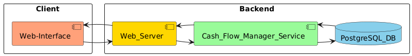
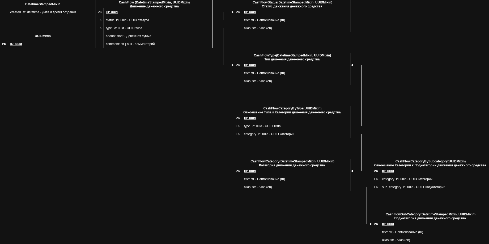

# Cash Flow Manager

* * *

**Задача (Бизнес Задача):**
Реализация веб-приложения, которое позволяет пользователям реализовывать CRUD-операции **Движения Денежных Средств**.
* * *


## Оглавление:
- [Требования](#требования)
- [Архитектура сервиса](#архитектура-сервиса)
- [Архитектура данных в Data Base](#архитектура-данных-в-data-base)
- [Используемые технологии в проекте](#используемые-технологии-в-проекте)
- [Запуск проекта (локально)](#запуск-проекта-локально)
- [Запуск проекта (docker-compose)](#запуск-проекта-docker-compose)
- [Сайт проекта](#сайт-проекта)
- [Данные тестового пользователя](#данные-тестового-пользователя)
- [Дальнейшие доработки](#дальнейшие-доработки-проекта)
- [Соглашения разработки](#соглашения-разработки)
- [Code Style](#code-style)


## Требования:
### Бизнес:
1. Нельзя выбрать подкатегорию, если она не связана с выбранной категорией.
2. Нельзя выбрать категорию, если она не относится к выбранному типу.

### Функциональные:
1. Реализовать CRUD-операции над сущностью **Движение Денежных Средств**.
2. Присваивать сущности **Движение Денежных Средств** требуемые **Справочные** сущности (статус, тип, категория и 
подкатегория).
3. Реализовать CRUD-операции над **Справочными** сущностями (статус, тип, категория и подкатегория).
4. Реализовать связанность **Справочных** сущностей: **Категория** и **Подкатегория**, **Категория** и **Тип**.
5. Предоставить возможность вывода информации по сущности(-ям) **Движение Денежных Средств** с возможностью фильтрации: 
по дате (с указанием периода дат), статусу, типу, категории и подкатегории.

### Нефункциональные:
- **Availability**(доступность системы):
- - SLA(Service Level Agreement): 99%;
- - Время обработки запроса: ~200-300мс.;
- **Reliability**(надежность системы): >= 85%;
- **Fault Tolerance**(отказоустойчивость системы):


## Архитектура сервиса:



## Архитектура данных в Data Base:



## Используемые технологии в проекте:
- Python v.3.13: https://docs.python.org/3/;
- Django v.5.2.5: https://docs.djangoproject.com/en/5.2/;
- Uvicorn v. 0.35.0: https://www.uvicorn.org/;
- Postgres v.17.5 (psycopg2-binary v.2.9.10): https://www.postgresql.org/;


## Запуск проекта (локально):
1. Создайте файл **.env** и скопируйте в него конфигурации из файла **.env_example**. Добавьте те конфигурации, 
которые имеют **[Local]** (это необходимый минимум, остальные по необходимости). Обратите внимание на конфигурации при 
поднятии доп. сервисов и запуске проекта (например, **POSTGRES_HOST**). 

2. При необходимости, поднимите связанные сервисы в **docker-compose-local.yaml** (PostgreSQL):
```sh
docker compose -f ./docker-compose-local.yaml -f docker-compose.override.yaml up -d
```

3. Установите зависимости:
```sh
pip install -r requirements.txt
```

4. Примените миграции:
```sh
cd ./service_cash_manager
python manage.py migrate
```

5. Подгрузите тестовые данные:
```sh
cd ./service_cash_manager
python ./load_test_data/load_data.py
```

6. Загрузка static-files:
```sh
cd ./service_cash_manager
python manage.py collectstatic --no-input
```

7. Запустите REST-API часть проект (требуется указать директорию **service_notification** как root):
```sh
cd ./service_cash_manager
uvicorn service_cash_manager.asgi:application --host 127.0.0.1 --port 8000 --reload
```

8. Зайдите под тестовым пользователем, указанным ниже.


## Запуск проекта (docker-compose):
1. Создайте файл **.env** и скопируйте в него конфигурации из файла **.env_example**. Добавьте те конфигурации, 
которые имеют **[Docker_Compose]** (это необходимый минимум, остальные по необходимости).

2. Поднимите сервисы:
```sh
docker compose -f ./docker-compose.yaml up -d
```

3. Или, если требуется поднять сервисы с открытыми портами сервисов (**PostgreSQL**):
```sh
docker compose -f ./docker-compose.yaml -f docker-compose.override.yaml up -d
```

4. Зайдите под тестовым пользователем, указанным ниже.


## Сайт проекта:
- AdminPanel, авторизация (после запуска проекта): **http://127.0.0.1:8000/admin/login/?next=/admin/**


## Данные тестового пользователя:
| Username         | Password |
|------------------|----------|
| **admin**        | admin    |


## Дальнейшие доработки проекта:
- Добавление Web-Service (Nginx) для балансировки и раздачи статики;


## Соглашения разработки:
### GitFlow:
#### Ветки (branches):
- **main**: основная(работоспособная) ветка кода, содержащая код для отправки на ревью;
- **develop**: рабочая ветка, содержащая актуальную кодовую базу для разработки;

#### Работа с ветками:
- Разработка нового функционала: branch: develop -> feature/....;
- Исправление ошибки в новом функционале: branch: develop(main) -> fix/...;

### RESTful URI:
#### Версионирование:
- Поддержка **Stripe**-подхода (https://docs.stripe.com/api/versioning);

#### Шаблоны построения URI-методов:
- Ссылка на источник: https://www.vinaysahni.com/best-practices-for-a-pragmatic-restful-api#restful


## Code Style:
- **PEP8**(https://peps.python.org/pep-0008/);
- Docstring-формат - **reStructuredText (reST)**;
